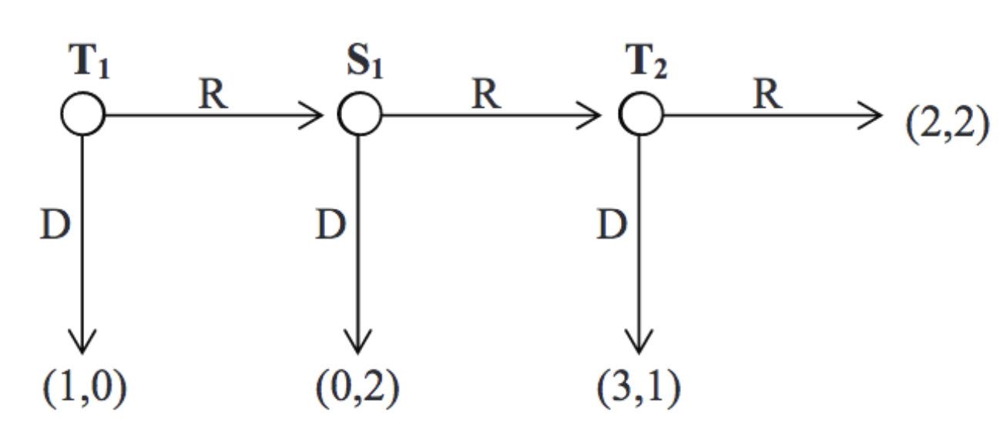
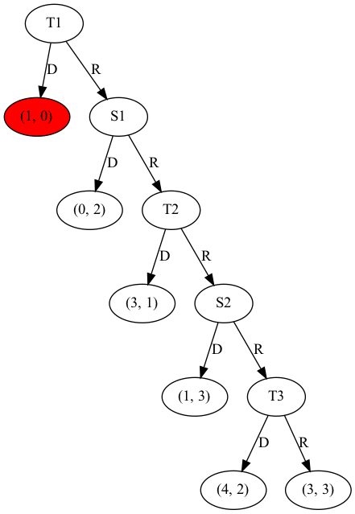

# Game Theory Mini Project 2

This repository contains the code for game theory mini project 2. This mini project generates a binary tree with a "centipede-like" structure, wherein the binary tree will only expand upon right child nodes. An example of a "centipede-like" binary tree can be seen below, extracted from Activity 5 Class 5.1 of 40.316 Game Theory:




An algorithm is used to find the Subgame Perfect Equilibrium (SPE) payoff of the binary tree using direct comparison between child nodes. This algorithm simulates the process of using backward induction to find the SPE of a binary tree. The final output will be the SPE payoff as well as the Price of Anarchy (PoA) as print statements.

Finally, the binary tree is shown on a png file output with the SPE node highlighted in **red**. Ultimately, this project shows that making selfish choices will inevitably lead to the poorest possible social outcome, despite starting from a strictly superior social outcome.

## Binary tree generation
The binary tree is generated by taking an input from the user stating the number of cycles to generate the tree on. 

The binary tree will then be generated up to k depth, where it will only be expanded upon from the right child node. 

This project also assumes that it's a direct extension to the game shown in Activity 5 Lecture 5.1, wherein the game is played between "Trinny" and "Susannah", abbreviated to "T" and "S" respectively. 

## Algorithm approach

The algorithm for this project is very simple, where it directly compares the child nodes of a given parent node and returns a node containing the "better" payoff. Naturally, it takes into account of which player is choosing at that stage to ensure that the truly superior payoff is returned. This algorithm is run repeatedly until reaching the root node, where the node with the SPE payoff is returned.

## Graph visualization



The graph visual is created using graphviz package and the output is in a png format. 

At each stage, each node edge is labelled with T{cycle number} or S{cycle number}. The letter represents the player's turn to choose, while the number represents the cycle number. For example, T1 means that it's the first cycle and it's Trinny's turn to choose. 

The payoffs are represented in tuples at the leaf nodes, with the first number representing the payoff for Trinny and the second number representing the payoff for Susannah. 

Finally, the node with the SPE payoff is coloured in red in the binary tree.

## Limitations of project
The user should only input for a binary tree with a low number of cycles. Local testing has found that the code will fail to generate an image with 100 cycles, but can comfortably generate a binary tree with 20 cycles.

## Steps to run project
This project assumes that you have Python3 installed in your device and that you are already in the project directory.

### 1. Start by creating a python virtual environment
```
python3 -m venv venv
```

### 2. Activate the python virtual environment
**On Mac:**
```
source venv/bin/activate
```

**On Windows:**
```
source venv\Scripts\activate
```

### 3. Install all dependencies required
```
pip install -r requirements.txt
```

### 4. Run the project at game_theory_mini_project.py

## Declaration of use of AI

No AI was used in this project at all. The entire project from binary tree generation to doc strings are written by hand. 